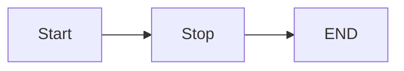

# **純文字測試**   
- -這是一段測試文字。
    - -測試
- -如果點擊標題後這行字會消失，代表你的標籤功能是正常的。
- -如果這行字還在，代表你的標籤寫法有誤。
> [!abstract]- 點擊展開架構圖
> ```mermaid
> graph LR
> A --> B
> ```


```mermaid
flowchart LR
Start --> Stop
Stop --> END
```


![[Pasted image 20260424225801.png]]
